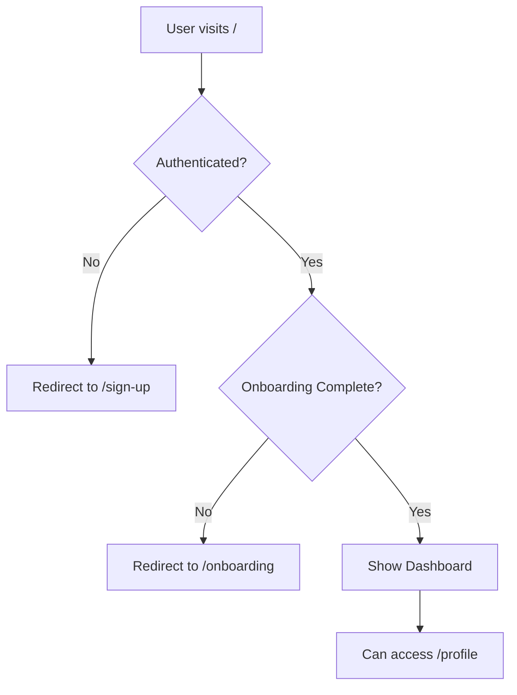

# 🚀 Next.js + Clerk Auth Starter

A modern authentication starter template built with **Next.js 15**, **Clerk**, **Supabase**, and **Tailwind CSS**. Get up and running with a fully functional authentication system in minutes.


## 📸 Screenshots

| Sign Up | Dashboard | Profile |
|---------|-----------|---------|
| Clerk Sign Up Form | Authenticated Dashboard | Profile Update Form |

## ✨ Features

- 🔐 **Authentication** - Sign up, sign in, and sign out with Clerk
- 📝 **Onboarding Flow** - Custom user onboarding with metadata storage
- 🛡️ **Route Protection** - Middleware-based route protection
- 💾 **Supabase Integration** - Profile management with Supabase database
- 🌙 **Dark Mode** - Full dark mode support with Tailwind CSS
- ⚡ **Next.js 15** - Latest Next.js with App Router
- 🎨 **Tailwind CSS v4** - Modern styling with Tailwind
- 📱 **Responsive Design** - Mobile-first responsive UI
- 🔄 **Server Actions** - Modern React Server Actions for data mutations

## 📁 Project Structure

```
src/
├── app/
│   ├── page.tsx              # Home/Dashboard page
│   ├── layout.tsx            # Root layout
│   ├── globals.css           # Global styles
│   ├── onboarding/           # Onboarding flow
│   │   ├── page.tsx
│   │   ├── layout.tsx
│   │   └── _actions.ts
│   ├── profile/              # Profile management (Supabase)
│   │   ├── page.tsx
│   │   └── _actions.ts
│   ├── sign-in/
│   │   └── [[...sign-in]]/
│   │       └── page.tsx      # Sign in page
│   └── sign-up/
│       └── [[...sign-up]]/
│           └── page.tsx      # Sign up page
├── lib/
│   └── supabase.ts           # Supabase client configuration
├── middleware.ts             # Auth middleware
└── components/               # Reusable components

supabase/
└── migrations/               # Database migrations
    └── 001_create_profiles_table.sql
```

## 🚀 Getting Started

### Prerequisites

- Node.js 18+ 
- npm, yarn, or pnpm
- [Clerk Account](https://clerk.com/)
- [Supabase Account](https://supabase.com/)

### 1. Clone the repository

```bash
git clone https://github.com/tanthuqb/nextjs-clerk-auth-starter.git
cd nextjs-clerk-auth-starter
```

### 2. Install dependencies

```bash
npm install
# or
yarn install
# or
pnpm install
```

### 3. Set up environment variables

Create a `.env.local` file in the root directory:

```env
# Clerk
NEXT_PUBLIC_CLERK_PUBLISHABLE_KEY=pk_test_xxxxx
CLERK_SECRET_KEY=sk_test_xxxxx
NEXT_PUBLIC_CLERK_SIGN_IN_URL=/sign-in
NEXT_PUBLIC_CLERK_SIGN_UP_URL=/sign-up
NEXT_PUBLIC_CLERK_SIGN_UP_FALLBACK_REDIRECT_URL=/
NEXT_PUBLIC_CLERK_SIGN_IN_FALLBACK_REDIRECT_URL=/

# Supabase
NEXT_PUBLIC_SUPABASE_URL=https://xxxxx.supabase.co
NEXT_PUBLIC_SUPABASE_ANON_KEY=eyJxxxxx
```

> 📌 Get your Clerk API keys from [Clerk Dashboard](https://dashboard.clerk.com/)
> 
> 📌 Get your Supabase keys from [Supabase Dashboard](https://supabase.com/dashboard)

### 4. Set up Supabase Database

1. Go to your Supabase project → SQL Editor
2. Copy and run the migration from `supabase/migrations/001_create_profiles_table.sql`

```sql
-- Creates profiles table with RLS enabled
-- See full migration file for complete SQL
```

### 5. Run the development server

```bash
npm run dev
```

Open [http://localhost:3000](http://localhost:3000) to see the app.

## 🔒 Authentication Flow



1. **Unauthenticated users** visiting `/` are redirected to `/sign-up`
2. **After sign up/sign in**, users are redirected to `/onboarding`
3. **After completing onboarding**, users can access the dashboard at `/`
4. **Profile page** (`/profile`) allows users to update their profile stored in Supabase
5. **Invalid routes** redirect to `/sign-up` for unauthenticated users

## 💾 Supabase Profile Schema

The `profiles` table stores additional user data:

| Column | Type | Description |
|--------|------|-------------|
| id | UUID | Primary key (auto-generated) |
| clerk_user_id | TEXT | Clerk user ID (unique, indexed) |
| full_name | TEXT | User's full name |
| avatar_url | TEXT | Avatar URL (synced from Clerk) |
| bio | TEXT | User bio/description |
| phone | TEXT | Phone number |
| address | TEXT | Address |
| created_at | TIMESTAMP | Created timestamp (auto) |
| updated_at | TIMESTAMP | Updated timestamp (auto-trigger) |

## 🛠️ Customization

### Modify Onboarding Fields

Edit `src/app/onboarding/page.tsx` to customize the onboarding form fields.

### Modify Profile Fields

1. Update the `Profile` interface in `src/lib/supabase.ts`
2. Add new fields to the form in `src/app/profile/page.tsx`
3. Update the Supabase table schema accordingly

### Add Protected Routes

Update `src/middleware.ts` to add or modify protected routes:

```typescript
const isPublicRoute = createRouteMatcher([
  '/',
  '/about',
  '/sign-in(.*)',
  '/sign-up(.*)',
])
```

### Customize Clerk Theme

Visit [Clerk Dashboard](https://dashboard.clerk.com/) → Customization to modify:
- Colors and branding
- Social login providers
- Email templates
- Redirect URLs

## 🧪 Tech Stack

| Technology | Purpose |
|------------|---------|
| [Next.js 15](https://nextjs.org/) | React framework with App Router |
| [Clerk](https://clerk.com/) | Authentication & user management |
| [Supabase](https://supabase.com/) | PostgreSQL database & API |
| [Tailwind CSS v4](https://tailwindcss.com/) | Utility-first CSS framework |
| [TypeScript](https://www.typescriptlang.org/) | Type safety |

## 📚 Resources

- [Next.js Documentation](https://nextjs.org/docs)
- [Clerk Documentation](https://clerk.com/docs)
- [Supabase Documentation](https://supabase.com/docs)
- [Tailwind CSS Documentation](https://tailwindcss.com/docs)

## 🚀 Deploy on Vercel

The easiest way to deploy your Next.js app is to use the [Vercel Platform](https://vercel.com/new).

[](https://vercel.com/new/clone?repository-url=https://github.com/tanthuqb/nextjs-clerk-auth-starter&env=NEXT_PUBLIC_CLERK_PUBLISHABLE_KEY,CLERK_SECRET_KEY,NEXT_PUBLIC_SUPABASE_URL,NEXT_PUBLIC_SUPABASE_ANON_KEY)

### Environment Variables for Deployment

Make sure to add these environment variables in your Vercel project settings:

- `NEXT_PUBLIC_CLERK_PUBLISHABLE_KEY`
- `CLERK_SECRET_KEY`
- `NEXT_PUBLIC_SUPABASE_URL`
- `NEXT_PUBLIC_SUPABASE_ANON_KEY`

## 🤝 Contributing

Contributions are welcome! Please feel free to submit a Pull Request.

1. Fork the repository
2. Create your feature branch (`git checkout -b feature/amazing-feature`)
3. Commit your changes (`git commit -m 'Add some amazing feature'`)
4. Push to the branch (`git push origin feature/amazing-feature`)
5. Open a Pull Request

## 📄 License

MIT License - feel free to use this starter for your projects!

---

Made with ❤️ by [tanthuqb](https://github.com/tanthuqb)
