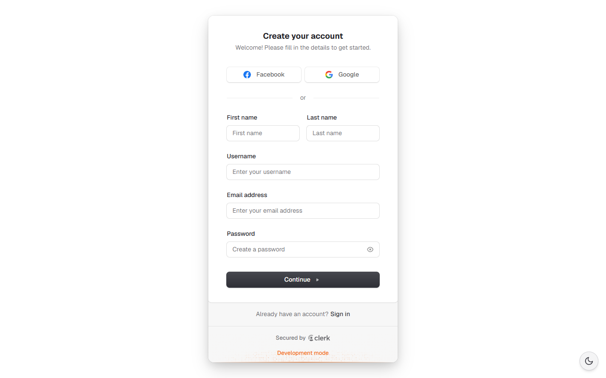
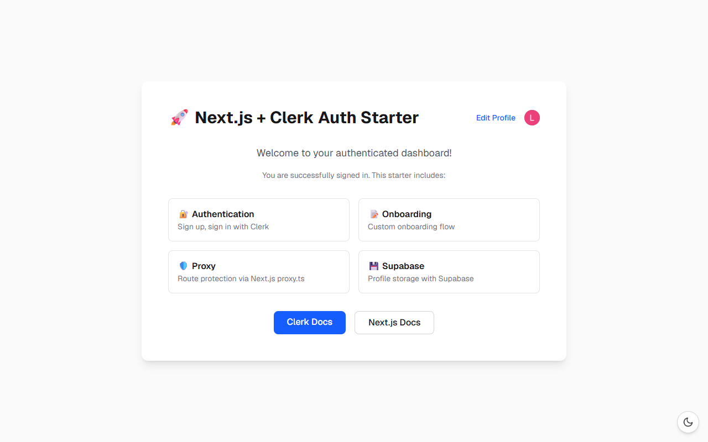
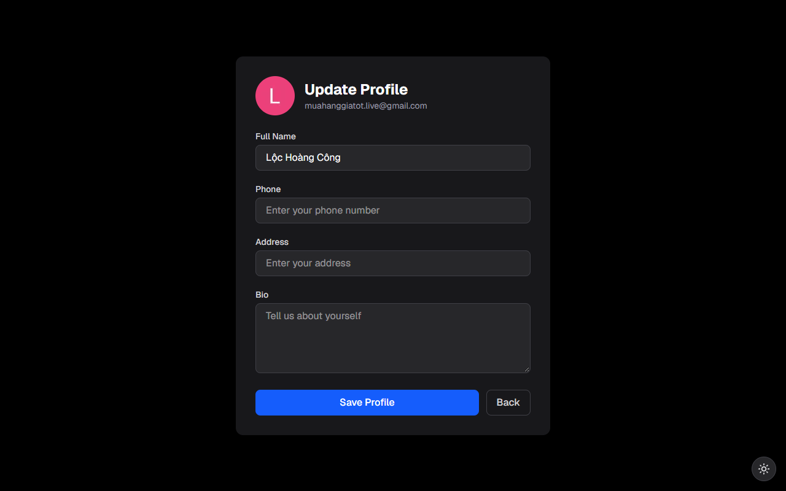

# Next.js Clerk Authentication Starter

A production-ready authentication starter kit built with **Next.js 16**, **Clerk**, **Supabase**, and **Tailwind CSS 4**.
Complete with user authentication flows, protected routes, onboarding, profile management, theme switching, end-to-end tests, and a clean modern UI.

[](https://nextjs-clerk-auth-starter.vercel.app)
[](https://github.com/tanthuqb/nextjs-clerk-auth-starter)


---

## Screenshots

| Sign Up | Dashboard | Profile (Dark Mode) |
|---------|-----------|---------------------|
|  |  |  |

> Captured from the live deployment at 1280x800. See [`screenshots/README.md`](./screenshots/README.md) to refresh them.

---

## Features

### Authentication (Clerk)
- Sign up / sign in with email or OAuth (Clerk `<SignUp />` and `<SignIn />`)
- Session management and persistence
- Signed-out visitors are redirected to `/sign-up` (or `/sign-in` for `/profile` and `/onboarding`, returning afterwards)
- Sign out from the `<UserButton />` returns to `/sign-up`

### Onboarding
- New users are redirected to `/onboarding` until `publicMetadata.onboardingComplete` is `true`
- The onboarding Server Action stores the answers in Clerk public metadata

### User Profile
- Update profile information (name, phone, address, bio)
- Avatar synced from Clerk (set on the server from the Clerk user, never from form input)
- Profile data stored in Supabase (`profiles` table, upsert by Clerk user ID)

### Route Protection
- `src/proxy.ts` (Next.js 16's replacement for `middleware.ts`) runs `clerkMiddleware()` and handles redirects
- Resource-based checks in every protected page, layout and Server Action (Clerk's recommended model, which replaces the deprecated `createRouteMatcher()`)

### UI/UX
- Dark / light theme toggle (floating button, remembered in `localStorage`, defaults to the system theme, no flash on load)
- Responsive mobile-first design
- Custom loading, error, global error and 404 pages

### Database Integration
- Supabase PostgreSQL via `@supabase/supabase-js`
- Supports the new Supabase **publishable key** (`sb_publishable_...`) with fallback to the legacy anon key
- Row Level Security scoped to the Clerk user via Supabase third-party auth (see [Database Setup](#database-setup))
- Auto-updated timestamps

### Testing
- Playwright end-to-end tests with Clerk's official `@clerk/testing` helpers

---

## Tech Stack

| Technology | Version | Purpose |
|------------|---------|---------|
| [Next.js](https://nextjs.org/) | 16.3 | React framework with App Router and Turbopack |
| [React](https://react.dev/) | 19.3 | UI library |
| [Clerk](https://clerk.com/) (`@clerk/nextjs`) | 7.x (Core 3) | Authentication and user management |
| [Supabase](https://supabase.com/) (`@supabase/supabase-js`) | 2.x | PostgreSQL database and API |
| [Tailwind CSS](https://tailwindcss.com/) | 4.3 | Utility-first CSS framework |
| [TypeScript](https://www.typescriptlang.org/) | 6.0 | Type safety |
| [Playwright](https://playwright.dev/) + `@clerk/testing` | 1.63 / 2.x | End-to-end tests |

---

## Project Structure

```
src/
├── app/
│   ├── page.tsx              # Dashboard (signed-in + onboarded users)
│   ├── layout.tsx            # Root layout, ClerkProvider, theme script
│   ├── loading.tsx           # Loading UI
│   ├── error.tsx             # Error boundary
│   ├── not-found.tsx         # 404 page
│   ├── global-error.tsx      # Global error handler
│   ├── globals.css           # Global styles (class-based dark mode)
│   ├── onboarding/           # Onboarding flow
│   │   ├── page.tsx
│   │   ├── layout.tsx        # Auth check + redirect when already onboarded
│   │   └── _actions.ts
│   ├── profile/              # Profile management
│   │   ├── page.tsx
│   │   ├── layout.tsx        # Auth + onboarding check
│   │   └── _actions.ts
│   ├── sign-in/
│   │   └── [[...sign-in]]/
│   │       └── page.tsx
│   └── sign-up/
│       └── [[...sign-up]]/
│           └── page.tsx
├── components/
│   └── ThemeToggle.tsx       # Dark / light theme toggle
├── lib/
│   └── supabase.ts           # Supabase server client factory
├── types/
│   └── globals.d.ts          # Clerk session claim types
└── proxy.ts                  # Clerk proxy (formerly middleware.ts)

e2e/                          # Playwright tests
├── global.setup.ts           # Clerk testing token + test-user sign-in
├── public.spec.ts            # Signed-out flows
├── authenticated.spec.ts     # Onboarding, dashboard, profile, theme, 404
└── helpers.ts

supabase/
└── migrations/
    ├── 001_create_profiles_table.sql
    └── 002_clerk_rls_policies.sql
```

---

## Quick Start

### Prerequisites

- Node.js 20.9+ (Node.js 24 LTS recommended)
- [Clerk account](https://clerk.com/)
- [Supabase account](https://supabase.com/)

### Installation

```bash
# Clone the repository
git clone https://github.com/tanthuqb/nextjs-clerk-auth-starter.git

# Navigate to project
cd nextjs-clerk-auth-starter

# Install dependencies
npm install

# Set up environment variables
cp .env.example .env.local

# Run development server
npm run dev
```

Open [http://localhost:3000](http://localhost:3000) to see the app.

### Clerk session token (required for onboarding)

The proxy and pages read `onboardingComplete` from the session token, so the token must include the user's public metadata.
In the Clerk Dashboard go to **Sessions -> Customize session token** and add:

```json
{
  "metadata": "{{user.public_metadata}}"
}
```

Without this, signed-in users are always sent back to `/onboarding`.

---

## Environment Variables

Create a `.env.local` file in the root directory (see `.env.example`):

```env
# Clerk
NEXT_PUBLIC_CLERK_PUBLISHABLE_KEY=pk_test_xxxxx
CLERK_SECRET_KEY=sk_test_xxxxx
NEXT_PUBLIC_CLERK_SIGN_IN_URL=/sign-in
NEXT_PUBLIC_CLERK_SIGN_UP_URL=/sign-up
NEXT_PUBLIC_CLERK_SIGN_UP_FALLBACK_REDIRECT_URL=/
NEXT_PUBLIC_CLERK_SIGN_IN_FALLBACK_REDIRECT_URL=/

# Supabase
NEXT_PUBLIC_SUPABASE_URL=https://xxxxx.supabase.co
NEXT_PUBLIC_SUPABASE_PUBLISHABLE_KEY=sb_publishable_xxxxx
# Legacy fallback, only used when the publishable key is not set:
# NEXT_PUBLIC_SUPABASE_ANON_KEY=eyJxxxxx

# Send the Clerk session token to Supabase (enable after the RLS migration, see below)
SUPABASE_CLERK_AUTH=false

# Playwright E2E test user (optional)
E2E_CLERK_USER_USERNAME=
E2E_CLERK_USER_PASSWORD=
```

> Get Clerk keys: [Clerk Dashboard](https://dashboard.clerk.com/)
> Get Supabase keys: [Supabase Dashboard](https://supabase.com/dashboard) -> Project Settings -> API Keys

---

## Database Setup

### 1. Create the table

Run [`supabase/migrations/001_create_profiles_table.sql`](./supabase/migrations/001_create_profiles_table.sql) (Supabase SQL Editor or `supabase db push`).

> **Security warning:** the policies in `001` use `USING (true)`, which lets **anyone holding the public key read and modify every profile**. They are only suitable for local experiments. Apply `002` for any real deployment.

### 2. Secure it with Clerk + Row Level Security

`002_clerk_rls_policies.sql` replaces the permissive policies with owner-only policies based on the Clerk user ID (`auth.jwt()->>'sub'`), following the [Clerk + Supabase integration guide](https://clerk.com/docs/guides/development/integrations/databases/supabase).

Do these steps **in order**:

1. **Clerk Dashboard** -> [Supabase integration setup](https://dashboard.clerk.com/setup/supabase) -> **Activate Supabase integration**, then copy the **Clerk domain**.
2. **Supabase Dashboard** -> **Authentication -> Sign In / Providers -> Third-party auth** -> **Add provider -> Clerk**, and paste the Clerk domain.
3. Set `SUPABASE_CLERK_AUTH=true` in your environment and redeploy. The app now sends each user's Clerk session token with every Supabase request (`accessToken` option in `src/lib/supabase.ts`).
4. Apply [`supabase/migrations/002_clerk_rls_policies.sql`](./supabase/migrations/002_clerk_rls_policies.sql).

The resulting policies:

```sql
revoke all on table public.profiles from anon;

create policy "Users can view own profile" on public.profiles
  for select to authenticated
  using ((select auth.jwt() ->> 'sub') = clerk_user_id);

create policy "Users can insert own profile" on public.profiles
  for insert to authenticated
  with check ((select auth.jwt() ->> 'sub') = clerk_user_id);

create policy "Users can update own profile" on public.profiles
  for update to authenticated
  using ((select auth.jwt() ->> 'sub') = clerk_user_id)
  with check ((select auth.jwt() ->> 'sub') = clerk_user_id);

create policy "Users can delete own profile" on public.profiles
  for delete to authenticated
  using ((select auth.jwt() ->> 'sub') = clerk_user_id);
```

---

## Authentication Flow

```
User visits /
    |
Authenticated?
    |-- No  -> Redirect to /sign-up
    `-- Yes -> Onboarding complete?
                  |-- No  -> Redirect to /onboarding
                  `-- Yes -> Show Dashboard
                                 |
                           Can access /profile
```

---

## Scripts

| Command | Description |
|---------|-------------|
| `npm run dev` | Start the dev server (Turbopack) |
| `npm run build` | Production build |
| `npm run start` | Start the production server |
| `npm run lint` | ESLint |
| `npm run typecheck` | `tsc --noEmit` |
| `npm run test:e2e` | Run Playwright end-to-end tests |
| `npm run test:e2e:ui` | Run Playwright tests in UI mode |

---

## End-to-End Tests (Playwright)

Tests live in `e2e/` and use Clerk's official [`@clerk/testing`](https://clerk.com/docs/guides/development/testing/playwright/overview) helpers (`clerkSetup()`, `setupClerkTestingToken()`, `clerk.signIn()`).
`playwright.config.ts` starts `next dev` on **port 3103** (`http://localhost:3103`) and reuses a server that is already running there. Env vars are loaded from `.env.local`.

```bash
# One-time: install the browser
npx playwright install chromium

# Run all tests
npm run test:e2e

# Interactive UI mode
npm run test:e2e:ui
```

| Suite | Needs test user | Covers |
|-------|-----------------|--------|
| `public.spec.ts` | No | `/` redirects to sign-up, sign-in and sign-up pages render Clerk components, `/profile` redirects to sign-in, unknown routes redirect to sign-up, theme toggle |
| `authenticated.spec.ts` | Yes | Onboarding, dashboard, profile edit + save (persists to Supabase), theme toggle, 404 page |

### E2E test user

Authenticated tests are **skipped** unless these are set in `.env.local` (or your CI secrets):

```env
E2E_CLERK_USER_USERNAME=e2e+clerk_test@example.com
E2E_CLERK_USER_PASSWORD=a-strong-test-password
```

Create this user in your Clerk **development** instance with password sign-in enabled. A `+clerk_test` email address suppresses all Clerk emails and verification codes. The profile test writes to the `profiles` table in the configured Supabase project, so use a development database.

---

## Use Cases

This starter works well for:

- **SaaS applications** - apps with user management
- **Admin dashboards** - protected admin interfaces
- **E-commerce** - customer accounts and profiles
- **Web apps** - any app requiring user authentication

---

## Deploy

### Deploy on Vercel

[](https://vercel.com/new/clone?repository-url=https://github.com/tanthuqb/nextjs-clerk-auth-starter&env=NEXT_PUBLIC_CLERK_PUBLISHABLE_KEY,CLERK_SECRET_KEY,NEXT_PUBLIC_SUPABASE_URL,NEXT_PUBLIC_SUPABASE_PUBLISHABLE_KEY)

### Required Environment Variables

| Variable | Description |
|----------|-------------|
| `NEXT_PUBLIC_CLERK_PUBLISHABLE_KEY` | Clerk publishable key |
| `CLERK_SECRET_KEY` | Clerk secret key |
| `NEXT_PUBLIC_SUPABASE_URL` | Supabase project URL |
| `NEXT_PUBLIC_SUPABASE_PUBLISHABLE_KEY` | Supabase publishable key (or legacy `NEXT_PUBLIC_SUPABASE_ANON_KEY`) |
| `SUPABASE_CLERK_AUTH` | `true` once the Clerk third-party auth + RLS migration is in place |

---

## Contributing

Contributions are welcome! Please feel free to submit a Pull Request.

1. Fork the repository
2. Create your feature branch (`git checkout -b feature/amazing-feature`)
3. Run `npm run lint`, `npm run typecheck` and `npm run test:e2e`
4. Commit your changes (`git commit -m 'Add amazing feature'`)
5. Push to the branch (`git push origin feature/amazing-feature`)
6. Open a Pull Request

---

## License

MIT License - feel free to use this starter for your projects!

---

## Author

**tanthuqb**

- GitHub: [@tanthuqb](https://github.com/tanthuqb)
- Demo: [nextjs-clerk-auth-starter.vercel.app](https://nextjs-clerk-auth-starter.vercel.app)

---

<p align="center">
  Made with Next.js, Clerk and Supabase
</p>
